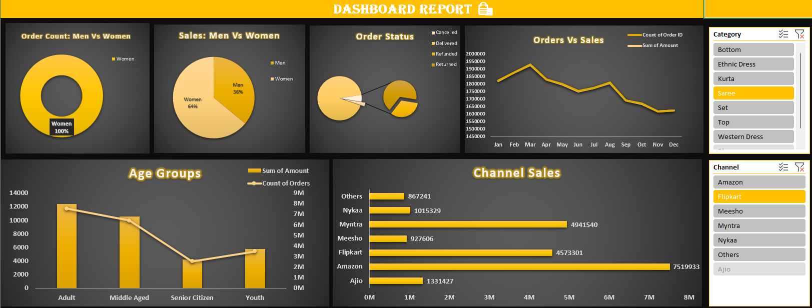
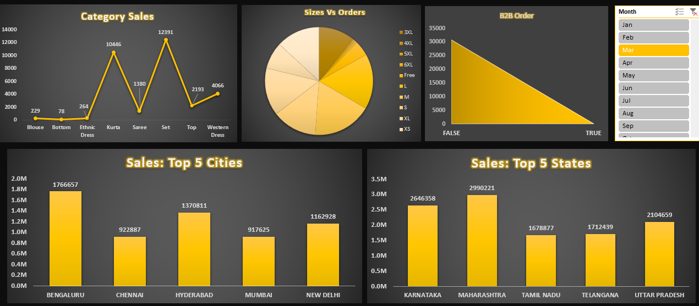

# 📊 Excel Sales Dashboard

### 📈 Project Description
This repository contains a fully interactive **Sales Dashboard** created using Microsoft Excel.  
It provides insights into business performance with  dynamic charts, and slicers.

---

## ✨ Features
- charts : Total Sales, Total Profit, Total Orders
- Trend Analysis through Line & Column Charts
- Product Category & Regional Sales Distribution
- Slicers for Interactivity (Category, Region, etc.)
- Professionally designed UI

---

## 🧩 Tools & Techniques Used
| Component | Usage |
|----------|------|
| Excel Formulas | SUM, IF, Lookup Functions |
| Pivot Tables | Data Analysis & Aggregation |
| Pivot Charts | Visual Insights |
| Slicers | Dynamic Filtering |
| Data Cleaning | Standardization & Error Handling |

---

## 📸 Dashboard Preview

| Full Dashboard View | KPIs & Charts Close-up |
|--------------------|----------------------|
|  |  |

---

## 🎯 Objective
To visualize sales performance effectively and support data-driven decision-making.

---

## 👩‍💻 Author
**Mamta Rathore**  
Data Analyst | Excel 

---

⭐ If you like this project, don’t forget to **Star** the repo on GitHub!
